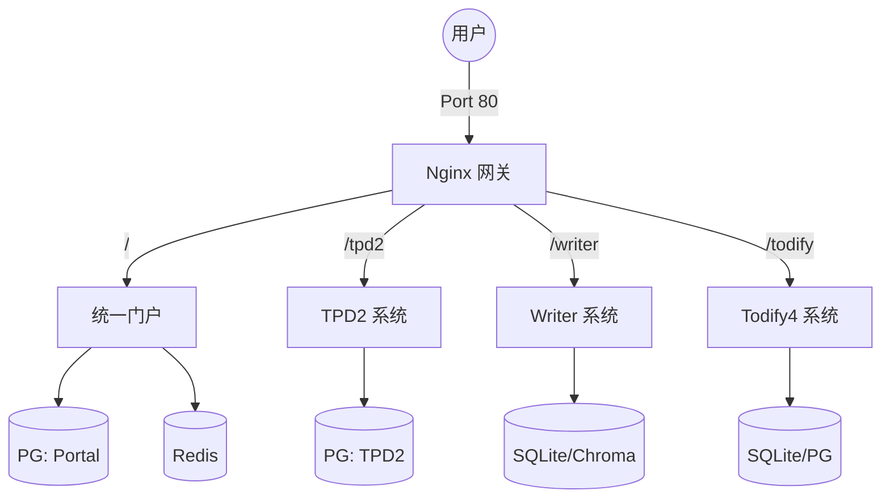

# 吉利 TPD 统一门户与子系统 - 聚合部署指南 (All-in-One)

> **版本**: v1.0
> **更新时间**: 2026-01-12
> **适用环境**: 阿里云服务器 (CentOS/Ubuntu) + 堡垒机文件传输
> **目标服务器**: `10.133.23.136` (示例 IP)

---

## 1. 概述

本方案采用 **All-in-One 聚合部署** 模式，通过一个统一的部署包 (`unified-deploy`) 一键启动以下所有服务：

1.  **统一门户 (Unified Portal)**: 流量入口与鉴权中心 (Port 80)
2.  **TPD2**: 汽车推广管理系统
3.  **Writer**: AI 文案助手
4.  **Todify4**: 任务管理系统
5.  **基础设施**: PostgreSQL (x2), Redis, Nginx 网关

### 架构图


---

## 2. 准备工作 (本地)

### 2.1 导出所有镜像
请在本地开发环境执行以下命令，导出所有项目的 Docker 镜像。

```bash
# 建议将所有镜像导出为独立文件，方便分块上传
docker save unified-portal-frontend:v1.0 postgres:15-alpine redis:7-alpine -o portal-imgs.tar
docker save tpd2-backend:v1.1 tpd2-frontend:v1.1 tpd2-postgres:v1.1 -o tpd2-imgs.tar
docker save writer-backend:latest writer-frontend:latest -o writer-imgs.tar
docker save todify4-backend:latest todify4-frontend:latest -o todify4-imgs.tar
```

### 2.2 打包部署脚本
将 `unified-deploy` 目录打包：

```bash
cd /Volumes/Lexar/git/07Docker/堡垒机/
tar -czf unified-deploy.tar.gz unified-deploy/
```

---

## 3. 服务器部署流程

### 3.1 上传文件
通过堡垒机 (SFTP/RZ) 将以下文件上传到服务器 `/root/` 或 `/opt/` 目录：

1.  `unified-deploy.tar.gz` (部署脚本包)
2.  `*.tar` (所有镜像包)

> **注意：大文件分片上传**
> 如果 `writer-imgs.tar` (约 2.3G) 过大导致上传失败，请使用本地拆分后的分片文件 (`writer-imgs.tar.part_*`) 上传。
>
> 上传后在服务器执行合并命令：
> ```bash
> cat writer-imgs.tar.part_* > writer-imgs.tar
> ```

### 3.2 解压与配置
登录服务器，执行以下操作：

```bash
# 1. 解压部署包
tar -xzf unified-deploy.tar.gz
cd unified-deploy

# 2. 将镜像文件移动到当前目录 (脚本会自动扫描当前目录下的 .tar 文件)
mv ../*.tar .

# 3. (可选) 修改配置
# 如果需要修改数据库密码或密钥，请编辑 envs/ 下的文件
# vi envs/portal.env
```

### 3.3 一键启动
执行部署脚本：

```bash
# 赋予执行权限
chmod +x deploy.sh

# 运行脚本
./deploy.sh
```

**脚本将自动执行以下操作**：
1.  检查 Docker 环境。
2.  创建必要的数据目录 (`./nginx`, `./envs` 等)。
3.  自动加载当前目录下所有的 `.tar` 镜像文件。
4.  启动 `docker-compose` 编排的所有服务。
5.  输出服务状态检查结果。

---

## 4. 验证与访问

部署完成后，请通过浏览器访问服务器 IP：

| 系统 | 访问地址 | 备注 |
| :--- | :--- | :--- |
| **统一门户** | `http://10.133.23.136/` | 默认入口 |
| **TPD2** | `http://10.133.23.136/tpd2/` | |
| **Writer** | `http://10.133.23.136/writer/` | |
| **Todify4** | `http://10.133.23.136/todify/` | |
| **健康检查** | `http://10.133.23.136/api/health` | 门户 API 检查 |

---

## 5. 常见运维操作

### 查看日志
```bash
# 查看所有服务日志
docker-compose logs -f

# 查看特定服务日志 (如网关)
docker-compose logs -f gateway
```

### 重启服务
```bash
# 重启所有
docker-compose restart

# 重启单个服务
docker-compose restart tpd2-backend
```

### 停止服务
```bash
# 停止并移除容器 (保留数据)
docker-compose down
```

### 数据备份
所有数据均持久化在 Docker Volume 中。备份命令：

```bash
# 备份 TPD2 数据库
docker exec tpd2-postgres pg_dump -U postgres todify2 > tpd2_backup.sql

# 备份 Portal 数据库
docker exec portal-postgres pg_dump -U portal portal > portal_backup.sql
```

---

## 6. 故障排查

**Q1: 访问 `/tpd2/` 显示 404 或白屏？**
*   检查 `gateway` 容器日志：`docker-compose logs gateway`。
*   确认 TPD2 前端容器是否已启动：`docker-compose ps`。

**Q2: 镜像加载失败？**
*   确认上传的 `.tar` 文件完整，大小是否符合预期。
*   尝试手动加载：`docker load -i <文件名>.tar`。

**Q3: 端口冲突 (Port 80 被占用)？**
*   修改 `docker-compose.yml` 中的 `gateway` 服务端口映射，例如改为 `8080:80`。
*   修改后重新启动：`docker-compose up -d`。
